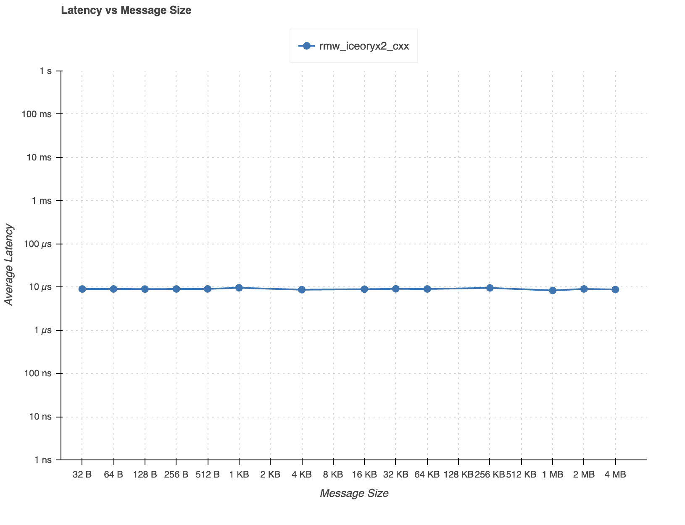

# rmw_iceoryx2

1. [Introduction](#introduction)
1. [Feature Completeness](#feature-completeness)
1. [Performance](#performance)
1. [Setup](#setup)
1. [Examples](#examples)
1. [Benchmarks](#benchmarks)
1. [FAQ](FAQ.md)
1. [Commercial Support](#commercial-support)
1. [Maintainers](#maintainers)
1. [Contributors](#contributors)

## Introduction

> [!IMPORTANT]
> The implementation is still in an "alpha" stage.
> Not all functionality is implemented/stable so surprises are to be expected.
>
> If encountering problems, please create an issue so we can converge to
> stability :).

ROS 2 [`rmw`](https://github.com/ros2/rmw) implementation for [`iceoryx2`](https://github.com/eclipse-iceoryx/iceoryx2).

`iceoryx2` is a shared memory IPC middleware written in Rust for improved memory
safety and easier safety certifiability. The implementation leverages the C++
bindings to the Rust core.

## Feature Completeness

| Feature                          | Status             |
|----------------------------------|--------------------|
| Node                             | :white_check_mark: |
| Guard Condition                  | :white_check_mark: |
| Event                            | :construction:     |
| Publish-Subscribe                | :white_check_mark: |
| Server-Client                    | :construction:     |
| Message Serialization            | :white_check_mark: |
| Waitset                          | :white_check_mark: |
| Graph                            | :construction:     |
| QoS                              | :construction:     |
| Logging                          | :white_check_mark: |

## Performance

> [!NOTE]
>
> * The latency measurement can be reproduced with [these instructions](performance_test)
> * The measurements were taken on a Ryzen 3950X without a fine-tuned OS - lower latency could be expected on a fine-tuned target
> * The [`performance_test`](https://gitlab.com/ApexAI/performance_test/-/tree/master/performance_test) tool uses `rmw_iceoryx2` through
>   the ROS 2 stack, which naturally introduces some overhead compared to pure `iceoryx2`
> * The minimal possible latency achievable with `iceoryx2` is [in the nanosecond range](https://github.com/eclipse-iceoryx/iceoryx2/tree/main?tab=readme-ov-file#comparision-of-mechanisms)



## Setup

1. Set up [your environment](https://docs.ros.org/en/rolling/Installation/Alternatives/Latest-Development-Setup.html) for building ROS 2 from source

1. Create a ROS 2 workspace:

    ```console
    mkdir -p ~/workspace/src
    ```

1. Clone the ROS 2 source:

    ```console
    vcs import --input https://raw.githubusercontent.com/ros2/ros2/rolling/ros2.repos ~/workspace/src
    ```

1. Clone `iceoryx2` source:

    ```console
    vcs import --force --input https://raw.githubusercontent.com/ekxide/rmw_iceoryx2/refs/heads/rolling/iceoryx.repos ~/workspace/src
    ```

1. Clone `rmw_iceoryx2`:
    1. Either `rolling` or a specific version tag e.g. `v0.1.0`

    ```console
    git clone -b rolling https://github.com/ekxide/rmw_iceoryx2.git ~/workspace/src/rmw_iceoryx2/
    ```

1. Build ROS 2 with `rmw_iceoryx2` and the demo nodes, using the `build` recipe
   of the root `justfile` (requires [`just`](https://github.com/casey/just#installation)):

    ```console
    cd ~/workspace/
    just -f src/rmw_iceoryx2/justfile build rmw_iceoryx2_talker_demo_nodes
    ```

    The recipe runs `colcon build` for `rmw_iceoryx2`, the ROS 2 CLI and the
    given packages.  
    To see the plain `colcon` commands, add `--dry-run`:

    ```console
    just -f src/rmw_iceoryx2/justfile --dry-run build rmw_iceoryx2_talker_demo_nodes
    ```

1. Verify the build:

    ```console
    source ~/workspace/install/setup.zsh # or setup.bash
    ros2 doctor --report
    ```

    The middleware should be properly set:

    ```
    RMW MIDDLEWARE
      middleware name    : rmw_iceoryx2_cxx
    ```

1. Verify functionality by running the demo nodes:
    1. Terminal 1

        ```console
        source ~/workspace/install/setup.zsh # or setup.bash
        ROS_DISABLE_LOANED_MESSAGES=0 ros2 run rmw_iceoryx2_talker_demo_nodes listener_basic_types
        ```

    1. Terminal 2

        ```console
        source ~/workspace/install/setup.zsh # or setup.bash
        ROS_DISABLE_LOANED_MESSAGES=0 ros2 run rmw_iceoryx2_talker_demo_nodes talker_basic_types
        ```

## Examples

Examples live in [`examples/`](examples/) and are built and run via the root `justfile`.
Requires [`just`](https://github.com/casey/just#installation) and [`tmux`](
https://github.com/tmux/tmux#installation) for convenient orchestration.

Run all commands from the workspace root:

```console
# list the examples and their configurations
just -f src/rmw_iceoryx2/justfile list-examples

# build an example's packages
just -f src/rmw_iceoryx2/justfile build-example <example>

# run a configuration (opens a tmux session)
just -f src/rmw_iceoryx2/justfile run-example <example> <config>
```

For example, the basic talker/listener demo:

```console
just -f src/rmw_iceoryx2/justfile build-example talker
just -f src/rmw_iceoryx2/justfile run-example talker basic_types
```

See [`examples/README.md`](examples/README.md) for the full list and how to add an example.

## Benchmarks

Targeted latency benchmarks live in [`benchmark/`](benchmark/).
Requires [`just`](https://github.com/casey/just#installation) for convenient
orchestration.

They measure the one-way latency of `rmw_iceoryx2` at a configurable publish
rate for every pairing of ROS 2 and native `iceoryx2` endpoints. The
benchmark isolates overhead of the `rclcpp` layer across publish rates, not
latency across payload sizes.

Run from the workspace root:

```console
# build the benchmark packages
just -f src/rmw_iceoryx2/justfile build-benchmark

# list the available pairings and their parameters
just -f src/rmw_iceoryx2/justfile list-benchmarks

# run a pairing
just -f src/rmw_iceoryx2/justfile run-benchmark ros2-to-ros2 rate=1000 count=10000
```

See [`benchmark/README.md`](benchmark/README.md) for the pairings, parameters,
methodology, and how to interpret the results.

## Commercial Support

<!-- markdownlint-disable -->

<table width="100%">
  <tbody>
    <tr>
      <td align="center" valign="top" width="33%">
        <a href="https://ekxide.io">
        <br />
        </a>
        <a href="mailto:info@ekxide.io">info@ekxide.io</a>
      </td>
      <td>
        <ul>
          <li>accelerated development</li>
          <li>safety certification</li>
          <li>priority bug-fixing</li>
          <li>training and consulting</li>
        </ul>
      </td>
    </tr>
  </tbody>
</table>

<!-- markdownlint-enable -->

## Maintainers

<!-- markdownlint-disable -->

<table>
  <tbody>
    <tr>
      <td align="center" valign="top" width="14.28%">
          <a href="https://github.com/orecham">
          <br />
          <sub><b>»orecham«</b></sub></a></td>
    </tr>
  </tbody>
</table>

<!-- markdownlint-enable -->

## Contributors

It could be you!

This project is and will always remain fully open source. Looking to use
`iceoryx2` in your ROS 2 application but finding the implementation lacking
in some way? Your contributions can help improve it more quickly, and we'll
provide full support and guidance along the way.
